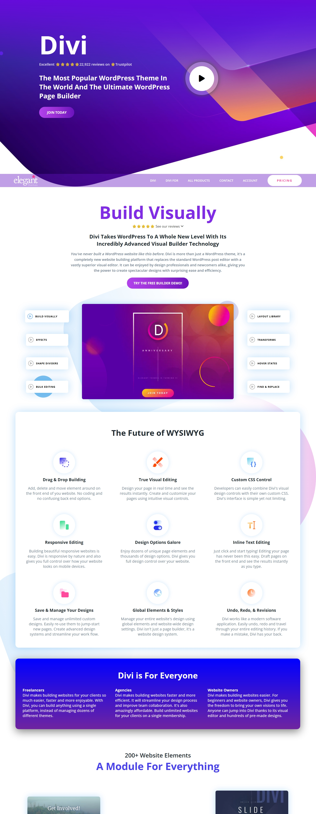

# 🎨 Divi Website Clone

A pixel-perfect, fully responsive front-end clone of the official Divi website built using HTML and CSS. This project was created to practice modern UI design techniques and layout structures using only front-end technologies.

## 🔗 Live Demo
👉 [View Live Site](https://yashgupta7373.github.io/Divi-Clone/)

## 📂 GitHub Repository
👉 [GitHub Repo](https://github.com/yashgupta7373/Divi-Clone)

## 🛠️ Tech Stack
- HTML5
- CSS3

## 📸 Screenshot


## ✨ Features
- Fully responsive design for mobile, tablet, and desktop
- Hero section with CTA and play button
- Animated buttons and gradients
- WYSIWYG feature section with icons
- Colorful cards and layout-based page sections
- Modular sectioning and semantic HTML

## 💡 Purpose
This project is a front-end clone of the [Divi WordPress Theme website](https://www.elegantthemes.com/), built to enhance layout-building skills, flexbox/grid usage, and professional visual styling using pure HTML and CSS.

## 🚀 How to Use
1. Clone the repository:
   ```bash
   git clone https://github.com/yashgupta7373/Divi-Clone.git
2. Open index.html in your browser.

📌 Note
This is a front-end clone for educational purposes only.

No JavaScript or backend logic has been added.

Made with 💜 by Yash Gupta